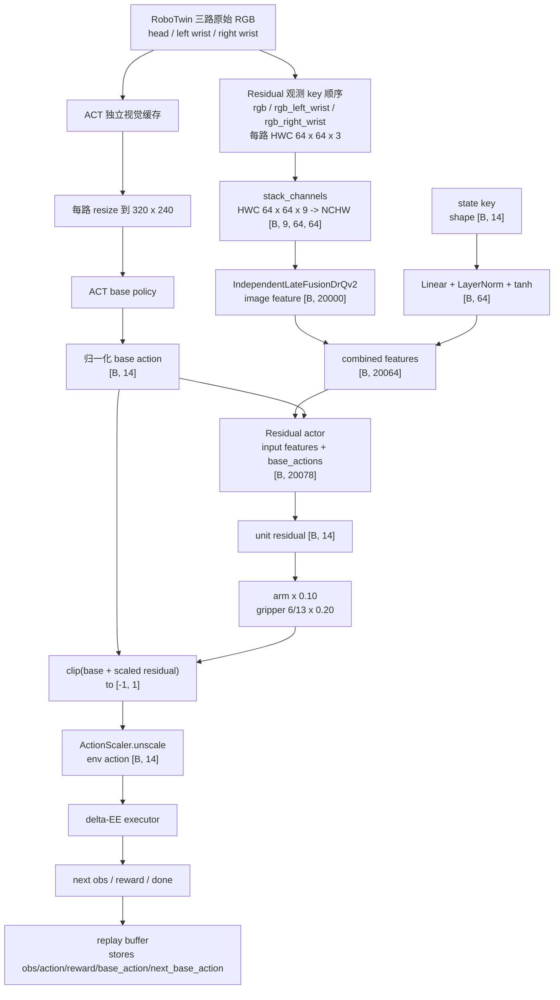
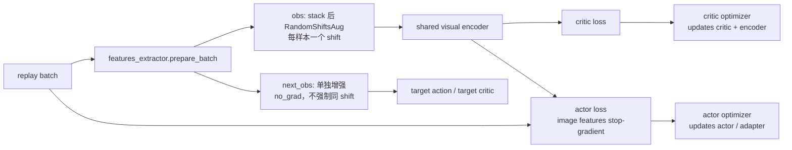
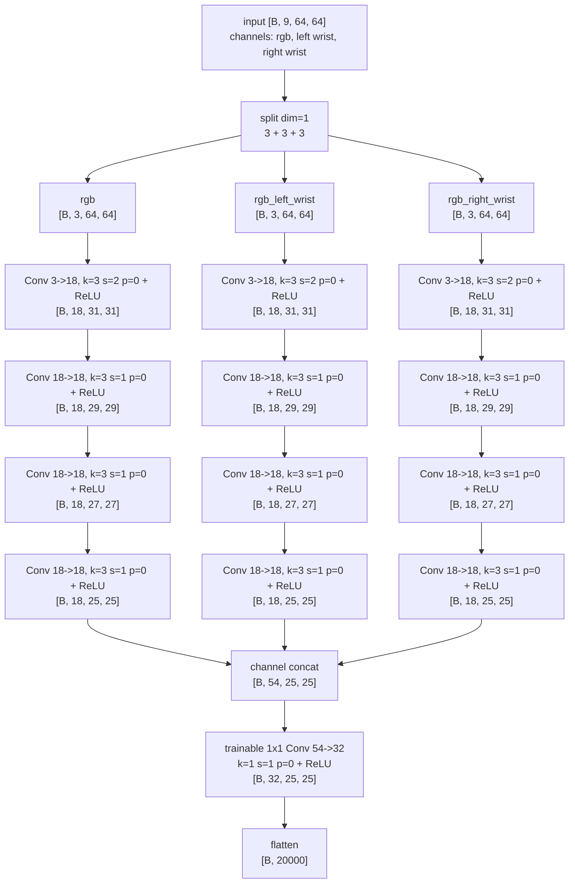

# RoboTwin `open_laptop` Residual SAC Pipeline

本文说明当前版本 rl-garden 中 `open_laptop` 的 ACT + Residual SAC 训练路径。ACT 数据转换与基准策略训练不在本文展开；这里仅说明当前 residual 配置实际依赖的 ACT checkpoint、输入分辨率与执行接线。

命令中任务名统一使用 `open_laptop`，控制模式使用 `delta_ee`。Residual policy 输出对 ACT base action 的有界修正，环境 adapter 再把 14 维归一化动作转换为 RoboTwin 指令。

## 训练实现与配置优化

### 1. 执行器修正

策略与环境之间使用以下调用链：

```text
ACT base action [B,14] + scaled residual [B,14]
  -> clip 到归一化 action space [-1,1]
  -> ActionScaler.unscale
  -> RoboTwinEnv.step
  -> ThreadedRoboTwinExecutor.step（每个 sub-env 一个 future）
  -> RoboTwinTaskAdapter.step
  -> 14D delta-EE 转为 RoboTwin 16D command
       left:  dxyz(3) + quaternion wxyz(4) + gripper(1)
       right: dxyz(3) + quaternion wxyz(4) + gripper(1)
  -> task.take_action(command, action_type="delta_ee")
  -> RoboTwin 规划并逐 tick 写入轨迹目标
  -> 检查真实关节是否到达末端目标，再返回下一次策略决策
```

14 维策略动作依次表示左右臂的 `dxyz(3) + drotvec(3) + gripper delta(1)`。Adapter 分别用 `ee_delta_pos_scale` 和 `ee_delta_rot_scale` 缩放平移与旋转增量，将 rotation vector 转为 `wxyz` quaternion；夹爪增量加到当前夹爪状态后裁剪到 `[0,1]`。转换后的 16 维指令再交给 RoboTwin `take_action`。

#### 原问题：目标已写入，但真实关节尚未到位

原 RoboTwin 控制循环按左右臂轨迹的相对进度写入关节目标，每写入一组目标就调用一次 `scene.step()`。当最后一个轨迹点被写入并推进一个 physics tick 后，循环便结束。这个结束条件只说明“轨迹目标已经全部发送”，不说明仿真中的真实关节已经收敛到最后一个目标。因此下一次高层策略动作可能在机械臂仍追踪上一目标时开始：策略看到的是滞后的物理状态，连续 delta-EE 指令也会在命令目标与真实末端位姿之间逐渐积累偏差。除此之外原执行器还会出现除零报错和自碰撞报错等。

当前执行路径用以下机制修正这一问题：

1. **Command reference**：下一次 delta-EE 不再默认叠加到可能滞后的真实位姿，而是叠加到上一条有效命令目标，使连续小增量不会因为单步物理滞后而被吞掉。
2. **Reanchor**：每次生成新目标前比较命令参考位姿与真实末端位姿；位置偏差超过 `0.005 m` 或旋转偏差超过 `2°` 时，把该臂的命令参考重新锚定到真实位姿，避免 command reference 持续累计误差。当前 launcher 启用 command reference 和 reanchor。
3. **Terminal settle**：规划轨迹执行完后，读取左右臂真实关节位置，并与各自规划轨迹的最后一个关节目标比较。连续关节差值先按 `[-π, π)` 包裹，再取所有受控关节绝对误差的最大值；只有两臂误差都不大于 `0.0005 rad` 才提前结束等待。尚未到位时，执行器继续写入末端关节目标（目标速度为零）并推进 `scene.step()`；当前 launcher 最多等待 `100` 个 physics ticks（0.4秒），同时每个 tick 仍检查任务是否已经成功。
4. **空轨迹和近零动作保护**：近零 delta 直接生成 hold 轨迹，不再调用可能产生零长度路径的规划器。若规划器仍返回 `status=Success` 但轨迹长度为 0，则把该臂标记为不可执行、使用非零长度 hold，并把 command reference 复位到真实位姿。这样既不会把空轨迹当成已完成动作，也避免原双臂同步条件中的 `now_id / n_step` 出现除零报错。
5. **规划终点校验**：当前 RoboTwin runtime 保留完整 articulation qpos，使用 `mplib_screw` 的有界步长候选，并校验规划终点的正向运动学（FK）。严格候选不可用时只保留可执行且最接近目标的部分路径；下一条命令再结合真实位姿和 reanchor 继续，而不是假装已到达理想笛卡尔目标。
6. **SRDF 允许碰撞对**：`envs/robot/planner.py` 读取机器人 SRDF 里的 `<disable_collisions>`，机器人配置中有些相邻部件本来就允许贴近或接触，修正将这些规则正确写入 MPlib allowed collision matrix传给规划器。这样正常相邻/固定部件不会被误报成自碰撞；其它碰撞检查仍保留，`plan_screw` 遇到真实碰撞仍会失败，并交给前述 hold/reanchor/下一步控制处理。

这里要区分两个不同上限：`delta_ee_terminal_settle_max_ticks=100` 限制一条 delta-EE 命令完成后的物理收敛等待；`step_lim=500` 限制一个 episode 的高层策略步数。不过两个上限叠加起来一定程度上降低了训练速度。

上述到位判定、空轨迹保护、command reference/reanchor、规划终点校验和 SRDF allowed collision matrix 位于当前配套 RoboTwin runtime（记录的目标 runtime 为 Git commit `964a4e4b1c434d62a5d106a8fbc543210641a8d9`）；rl-garden 负责产生 14 维动作、把相关参数传到 task config，并确保训练与评估走同一配置。为避免只提交 rl-garden 而漏掉真正的执行器修正，本次提交已把 RoboTwin 外部补丁放在 [`patches/robotwin/delta-ee-executor/`](../patches/robotwin/delta-ee-executor/README.md)：其中 `robotwin-delta-ee-executor.patch` 是可应用补丁，`files/envs/_base_task.py` 和 `files/envs/robot/planner.py` 是目标源码副本，`MANIFEST.json` 记录 base/target 文件哈希。

#### 超时保护只作为执行器异常边界

目标分支原本已有固定 `future.result(timeout=180)` 等待；当前包里的 [`executor.py`](../rl_garden/envs/robotwin/executor.py) 把等待上限接到配置 `executor_timeout_seconds`，并在 timeout 后以退出码 `124` 硬退出，避免 native MPLib/SAPIEN 调用卡在 C++ 或持有 sub-env lock 时拖住关闭流程。当前启动脚本没有额外改写这个值，使用默认 `180.0` 秒。这里保留说明，是因为该文件随提交包交付、review 时需要知道它的职责；它不是“目标已写入但真实关节未到位”的主要修正，正常动作到位仍由前述 terminal settle、hold、command reference 和 reanchor 保证。

本次提交中的相关文件作用如下：

- [`examples/eval_act_robotwin.py`](../examples/eval_act_robotwin.py)：ACT evaluation 入口接收并转发 delta-EE、command reference、reanchor、terminal settle、step cap 等参数，保证评估不会丢失训练使用的执行语义。
- [`rl_garden/common/env_args.py`](../rl_garden/common/env_args.py)：声明可序列化的 RoboTwin 环境参数，统一定义动作缩放、command reference/reanchor、terminal settle、step cap 和执行器超时。
- [`rl_garden/envs/backends/robotwin.py`](../rl_garden/envs/backends/robotwin.py)：把入口参数组装为 `RoboTwinEnvConfig` 和 RoboTwin task config，完成 rl-garden 到外部 RoboTwin runtime 的参数桥接。
- [`rl_garden/envs/robotwin/config.py`](../rl_garden/envs/robotwin/config.py)：保存环境配置，并校验 delta-EE 的 14 维动作、正数 timeout、reset/cache 和 reward 约束。
- [`rl_garden/envs/robotwin/adapter.py`](../rl_garden/envs/robotwin/adapter.py)：把归一化 14 维策略动作转换为 RoboTwin 16 维 delta-EE 指令，调用 `take_action`，并把连续关节角规范化到与演示数据一致的主值范围。
- [`rl_garden/envs/robotwin/executor.py`](../rl_garden/envs/robotwin/executor.py)：并行调度各 sub-env 的 `step/reset`；仅在 native 调用超过等待边界且无法安全取消时记录错误并以退出码 `124` 终止进程。
- [`patches/robotwin/delta-ee-executor/`](../patches/robotwin/delta-ee-executor/README.md)：交付外部 RoboTwin runtime 的两文件补丁。`envs/_base_task.py` 包含 command reference、reanchor、近零/空轨迹 hold、除零保护和 terminal settle；`envs/robot/planner.py` 包含 SRDF allowed collision matrix、`mplib_screw` 候选步长、完整 articulation qpos 和终点 FK 校验。

### 2. Reward 构建优化

Reward 构建相关代码已在此前提交完成，本次不重复提交 reward 文件：

- [reward commit `ef29090e5f5e7dc0406cb26d7f584a195f41ba24`](https://github.com/Nole326/rl-garden/commit/ef29090e5f5e7dc0406cb26d7f584a195f41ba24)
- [上游 PR #34](https://github.com/JaimeParker/rl-garden/pull/34)

### 3. Residual scale 与 SAC 训练配置

这一节只保留当前配置真正会影响训练行为项目。

|            配置/行为            |                       当前参考值                       |                    相对目标分支的来源                    |                                                               代码含义                                                               |
| :------------------------------: | :-----------------------------------------------------: | :------------------------------------------------------: | :-----------------------------------------------------------------------------------------------------------------------------------: |
|    arm/gripper residual scale    |                   `0.10` / `0.20`                   | 这是当前 residual 动作合成的核心改动，且夹爪必须单独缩放 |   14 维动作中索引 6、13 使用 gripper scale，其余维度使用 arm scale；最终归一化动作是`clip(base + unit_residual * scale, -1, 1)`。   |
| state-residual warmup checkpoint |               启用；warmup scale 为`0`               |     这是当前训练开始前 residual 行为的来源，不能省略     | 加载已有 residual policy；检查 observation/action space、参数形状与超参数兼容，学习开始前按配置选择 checkpoint policy 或零 residual。 |
|       critic-only 初始阶段       |              `7000` step；不冻结 encoder              |  它决定前 7000 步谁更新，直接影响视觉 encoder 学习路径  |      actor 暂不更新；由于当前配置使用`--no-critic-only-freeze-encoder`，critic optimizer 会同时更新 critic 和 shared encoder。      |
|     actor/critic 稳定性配置     | LayerNorm 均启用；log std clamp，min`-5`，init `-3` |  这些不是新算法，但 launcher 显式选择，且影响训练稳定性  |         residual policy 接通已有 LayerNorm/log-std 选项；actor optimizer 只更新 actor/actor adapter，不更新 shared encoder。         |

### 4. Reset 处理资源生命周期Vulkan fence error

当前配置的 reset 调用顺序可在 [`adapter.py`](../rl_garden/envs/robotwin/adapter.py) 中直接核查：

1. adapter 初始化 `reset_count = 0`，并把 `clear_cache_freq` 约束为至少 1；测试中取 4/8在单独训练时也可解决该问题且稍微减小了对训练速度的影响，不过当前 launcher 仍取 `1`。
2. 只有已经存在 `self.task` 的后续 reset 才把 `reset_count` 加 1；首个 task 创建前不增加计数。
3. 当 `reset_count % clear_cache_freq == 0` 时，本次 close 才请求清理 SAPIEN cache。当前 launcher 使用 `--robotwin.clear-cache-freq 1`，因此每次替换已有 task 时都请求清理。
4. `close()` 先把局部变量指向旧 task，再停止可能存在的 evaluation video，随后将 `self.task = None`，先移除 adapter 对 task 的强引用。
5. 调用 `task.close_env(clear_cache=False)` 释放旧 RoboTwin environment，但明确阻止其在对象引用尚未解除时提前清全局 renderer cache。
6. `finally` 中删除局部 `task`，调用一次 `gc.collect()`，让 task-specific Python/SAPIEN wrapper 引用先释放。
7. 若本次命中频率，再调用 `sapien.render.clear_cache()`；之后再次 `gc.collect()`。
8. 旧 task 清理完成后才 `make_task(...)` 并创建、初始化新的任务实例。

[`diagnostics/stress_robotwin_reset_vulkan.py`](../diagnostics/stress_robotwin_reset_vulkan.py) 用于对上述生命周期执行轻量压力诊断，不直接参与训练。

### 5. 视觉 encoder 融合与策略数据流

当前视觉路径的核心思路是：每个相机先用独立卷积 trunk 提取特征，再用 `1x1 Conv` 做后融合；融合后的图像特征与机器人本体状态拼接，供 Residual SAC 的 actor/critic 使用。ACT base policy 仍走独立的高分辨率三相机输入路径，不使用 residual replay 里的低分辨率图像。

视觉数据分流由 [`env.py`](../rl_garden/envs/robotwin/env.py) 和 ACT [`provider.py`](../rl_garden/models/act/provider.py) 提供；低分辨率图像的组合与增强位于 [`combined.py`](../rl_garden/encoders/combined.py)，三视角卷积和 late fusion 位于 [`drqv2_multiview.py`](../rl_garden/encoders/drqv2_multiview.py)。训练接线位于 [`residual_sac.py`](../rl_garden/training/online/residual_sac.py) 和 [`residual_policy.py`](../rl_garden/policies/residual_policy.py)。



图中的 batch 维记为 `B`。环境执行前会把归一化动作映射回环境 action space；replay 还保存当前和下一状态对应的 base action，使 critic/target action 使用与 rollout 一致的 residual 坐标约定。这里的 `state` 是 `RoboTwinEnv` observation space 里的 14 维本体状态，不包含 `base_actions`；`base_actions` 是 Residual policy 的额外输入，并作为 replay 额外字段保存。

训练采样时，增强和优化器关系如下：



当前 `random_shift` 是训练 batch 预处理，不是 ACT 路径的一部分。`prepare_batch(data.obs, data.next_obs)` 会分别处理 `obs` 和 `next_obs`；增强实现对 batch 中每个样本采样一个二维位移，因为三路图像已经拼成同一张 9 通道图，所以同一样本的三路视角共用同一次位移，不同样本可不同。代码没有把 `obs` 和 `next_obs` 绑定为相同位移。

多视角 encoder 内部结构如下：



三条相机分支是 `ModuleList` 里的三个独立 `nn.Sequential`，权重互不共享。最后的 `1x1 Conv` 是可训练后融合：它在每个 `25x25` 特征图网格索引处混合来自三路相机的 54 个通道，输出 32 个通道；因此不是简单求和，也不是只把三路拼接后直接展平。这里的“相同网格索引”只是卷积特征图上的位置对应，代码没有额外做跨相机几何标定或重投影对齐。

代码核对点：

- [`combined.py`](../rl_garden/encoders/combined.py) 从 observation space 中选择当前配置的 `rgb,rgb_left_wrist,rgb_right_wrist`，`stack_channels` 先按 HWC 最后一维拼接，再转为 NCHW；`prepare_batch()` 在训练采样后缓存增强图像。
- [`drqv2_multiview.py`](../rl_garden/encoders/drqv2_multiview.py) 要求输入正好是 9 通道，即三路 RGB；每路独立四层卷积 trunk 输出 `[B,18,25,25]`，拼成 `[B,54,25,25]` 后经 `1x1 Conv 54->32` 和 ReLU。
- [`env.py`](../rl_garden/envs/robotwin/env.py) 定义 `state` 为 14 维，并在当前配置下提供三路 `uint8` HWC RGB observation。
- [`residual_policy.py`](../rl_garden/policies/residual_policy.py) 在 actor 侧把 `base_actions` 拼到特征后面；当前 flat feature 路径没有额外 token adapter，因此 actor MLP 的输入是 `20064 + 14 = 20078` 维。
- 目标仓库已有的 `sac_policy.py` / `actor_critic.py` 负责 optimizer 与 critic 接线：critic 在 Q 网络内部拼接 `features` 和 `actions`，输入同样是 `20064 + 14 = 20078` 维；critic optimizer 参数组包含 twin critics 和 shared encoder，actor optimizer 只包含 actor/actor adapter。当前 `critic-only` 前 7000 步不冻结 encoder，所以这一阶段仍会更新视觉 trunk 与 `1x1` fusion。

#### 输入与预处理

当前配置同时保留两条视觉输入路径，但二者服务对象不同：

1. **ACT base policy 路径**：环境缓存原始三路 RGB；ACT provider 把每路调整到 `320x240` 后分别送入 ACT。ACT 不读取 residual replay 中的 `64x64` 图像，因此 residual 训练不会改变基准策略的视觉输入语义。
2. **Residual SAC 路径**：replay/训练批次使用三路低分辨率 RGB key：`rgb`、`rgb_left_wrist`、`rgb_right_wrist`，每路为 HWC `64x64x3`。`CombinedExtractor` 按当前 `image_keys` 取这三路图像，`stack_channels` 先在 HWC 最后一维拼成 `64x64x9`，再转为 NCHW `[B,9,64,64]`。
3. **像素值域**：`CombinedExtractor` 先把图像转为 float；uint8 风格输入在这里做 `x / 255.0`，已是浮点值域的输入只做 `x.float()`。因此进入卷积前的有效值域是：uint8 风格图像等价于 `x / 255.0 - 0.5`，已归一化浮点图像等价于 `x - 0.5`。
4. **训练增强**：当前 launcher 传入 `--image-augmentation random_shift` 和 `--image-random-shift-pad 4`。在 SAC/Residual SAC 训练采样后，训练循环调用 `features_extractor.prepare_batch(data.obs, data.next_obs)`；对于 `stack_channels`，它先得到整张 9 通道 NCHW 图，再做一次 `RandomShiftsAug` 并缓存。因此同一样本的三个视角共享同一次空间位移，不同样本可采到不同位移；`obs` 与 `next_obs` 是两次增强调用，不强制同位移。在线 ACT 推理路径不经过这一步；若某个 residual 推理/评估调用没有执行 `prepare_batch()`，`CombinedExtractor.forward()` 本身不会临时新增 random shift。
5. **维度约束**：`drqv2_independent_late_fusion` 只接受三路 RGB 拼成的 9 通道输入；通道数不为 9 会直接报错，避免把相机数量或输入顺序悄悄改掉。

#### 三路独立 encoder 与后融合

当前配置使用 `drqv2_independent_late_fusion`。每个相机有独立四层卷积 trunk，所有卷积都是 `padding=0`：

```text
Conv 3->18,  kernel=3, stride=2, padding=0, ReLU   64 -> 31
Conv 18->18, kernel=3, stride=1, padding=0, ReLU   31 -> 29
Conv 18->18, kernel=3, stride=1, padding=0, ReLU   29 -> 27
Conv 18->18, kernel=3, stride=1, padding=0, ReLU   27 -> 25
```

三路输出沿通道维拼成 `[B,54,25,25]`，再经可训练 `1x1` 卷积 `54->32`、`stride=1`、`padding=0` 和 ReLU 得到 `[B,32,25,25]`。展平图像特征为 20000 维；14 维 `state` 经 `Linear -> LayerNorm -> tanh` 编为 64 维，组合特征为 20064 维。

融合器是 `1x1` 卷积，三个 trunk 不共享参数；卷积权重正交初始化，bias 为零。

## 参考训练配置

|              项目              |                   值                   |
| :-----------------------------: | :------------------------------------: |
| total timesteps / replay buffer |            200000 / 100000            |
|  batch size / learning starts  |               64 / 5000               |
|    training frequency / UTD    |               64 / 0.25               |
|              gamma              |                  0.99                  |
|        policy LR / Q LR        |            0.00003 / 0.0003            |
|       entropy coefficient       |                  0.01                  |
|           image keys           | `rgb,rgb_left_wrist,rgb_right_wrist` |
|        residual encoder        |   `drqv2_independent_late_fusion`   |
|          augmentation          |            `random_shift`            |
|      ACT / residual images      |    三路`320x240` / 三路 `64x64`    |
|     environment step limit     |                  500                  |
|      checkpoint frequency      |                 25000                 |
|              seed              |                   0                   |

训练启动脚本 [`train_residual_sac_robotwin_open_laptop_independent_late_fusion.sh`](../scripts/train_residual_sac_robotwin_open_laptop_independent_late_fusion.sh) 使用仓库相对入口，并通过环境变量传入四个本机资源位置：RoboTwin checkout、RoboTwin assets、ACT checkpoint 和 residual warmup checkpoint。脚本显式列出当前配置所用的训练超参数、模型结构参数和 RoboTwin 环境参数；实际运行时必须指向正确的源码、RoboTwin runtime、assets 和 checkpoint。

```bash
ROBOTWIN_ROOT=/path/to/RoboTwin \
ROBOTWIN_ASSETS_PATH=/path/to/RoboTwin \
ACT_CHECKPOINT=/path/to/act/final.pt \
RESIDUAL_WARMUP_CHECKPOINT=/path/to/state-residual/final.pt \
bash scripts/train_residual_sac_robotwin_open_laptop_independent_late_fusion.sh
```

## 文件作用

|   模块   |                         主要文件                         |                    作用                    |
| :-------: | :-------------------------------------------------------: | :----------------------------------------: |
|   视觉   | `encoders/{combined,drqv2_multiview}.py`、registry、CLI |      拼接、增强、独立 trunk、1x1 融合      |
| ACT 输入 |           `env.py`、ACT provider/base policy           |            独立高分辨率视觉缓存            |
|  执行器  |   ACT eval、env args、backend、adapter/config/executor   | 动作转换、到位参数透传、reanchor、超时边界 |
| residual |             residual algorithm/policy/trainer             |    warmup、分尺度、LayerNorm、训练阶段    |
|   记录   |                    off-policy、logger                    |       checkpoint 恢复与 step 单调性       |
| 入口/验证 |                launcher、diagnostic、tests                |             固化参数和回归验证             |
